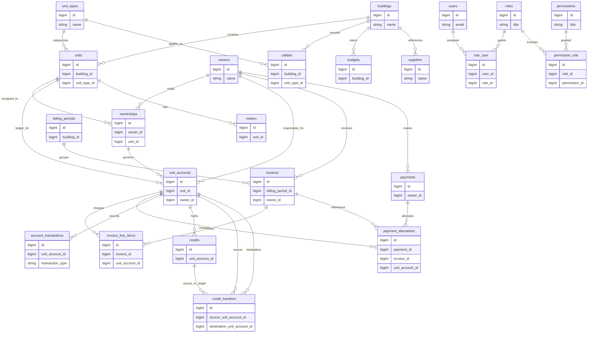

# Torre Balta 810 Legacy Modernization Plan

## 1. Executive Summary

The legacy Torre Balta 810 system is a PHP/MySQL condominium administration app for a single condominium association. It manages:

- Buildings and building metadata
- 183 total individually owned units across condos, parking spaces, and storage units
- Owners and ownership links
- Monthly maintenance billing
- Utility metering and utility allocations
- Payments and payment reconciliation
- Budgets, suppliers, and expenses
- Staff users, roles, and permissions
- Document and media attachments

The new system should preserve the business rules and operational records, but move them into a cleaner Supabase/Postgres architecture with:

- Stronger relational integrity
- Clearer naming
- Better support for auditability and reporting
- Separation between business entities and Laravel/PHP framework leftovers
- A schema that can support both internal staff workflows and owner-facing self-service later

The design must also support unit-level accounting. When one owner holds multiple units, each unit still needs its own financial ledger so charges, credits, payment allocations, and delinquencies can be traced at the unit level and then summarized at the owner level.

In this model:

- `units` represent the physical and legal property
- `owners` represent people or entities
- `ownerships` connect owners to units over time
- `unit_accounts` represent the financial ledger for a unit under a responsible owner and ownership period
- charges, payments, credits, allocations, and delinquencies must all be traceable to `unit_accounts`

This document intentionally stops at analysis and proposed structure. It does not introduce migrations, application code, or a final schema yet.

## 2. Legacy Database Overview

### Files provided

- `torrebal_admincondo.sql`
- `torrebal_stageadmin.sql`
- `torrebal_ta810.sql`

### Which database matters

`torrebal_admincondo.sql` is the primary legacy condominium admin database and contains the business data and most relevant application tables.

`torrebal_stageadmin.sql` appears to be a staging/admin variant and should be used only as a reference if it contains missing rows or schema drift that is not already in `admincondo`.

`torrebal_ta810.sql` is the public WordPress website database. It contains WordPress core tables, plugin tables, and public-site content. It should be ignored for the condominium management migration unless a later phase needs public-site content or media references.

## 3. Business Domain Model

### Buildings

The condominium is organized around one or more buildings. The legacy schema stores building identity, contact details, logos, tax information, and comments. In the modern system, building metadata should become first-class and clearly scoped.

### Owners

Owners are the people or entities that own one or more units. The same owner can own multiple unit types, and ownership is not limited to a single apartment.

### Units

The legacy system treats condos, parking spaces, and storage units as records in one `units` table, with a `unit_types` lookup describing the unit category. That is the right conceptual model to preserve.

Each unit should carry its own account or ledger in the modern system.

### Ownership

Ownership is many-to-many. The legacy `owner_unit` pivot confirms that an owner can own multiple units and a unit can be associated in a pivot-driven way. In the modern schema, ownership should become an explicit relation with dates, status, and billing flags.

Ownership should relate the owner to the unit ledger, not just to the unit row.

Ownerships provide the time-bound link that determines which owner is financially responsible for a unit account.

### Maintenance billing

The legacy system generates monthly maintenance bills per owner, not strictly per individual unit. The bill is composed of fixed charges, water charges, and other charges.

### Utility metering

Water is metered and billed. Electricity inside condos is not billed by Torre Balta 810 and should not be modeled as a unit charge. Common-area utility usage can be allocated.

### Payments

Payments are recorded at the owner level and can be applied to one or more maintenance bills. Legacy data shows both direct owner payment records and per-bill payment breakdown rows.

The payment model should remain provider-agnostic so it can support current bank deposits and future methods like Stripe without changing the core accounting design.

Accounting still happens at the unit-account level even when a bill or invoice is presented to the owner.

### Payment reconciliation

The system needs to reconcile one payment against multiple bills or partially settle a bill with separate components such as fixed, water, and other charges.

### Budgets

Budgets are tracked annually by building.

### Expenses and suppliers

Suppliers hold vendor identity and banking details. `other_charges` appears to capture unit-specific or ad hoc charge, expense, adjustment, or refund data, but it is not a clean expense ledger yet.

### Staff and users

The legacy app has a Laravel-style `users` table for staff and internal operators, not condominium owners. Staff access is role-based.

### Roles and permissions

Legacy RBAC is implemented with roles, permissions, and pivot tables. This should be preserved conceptually, but redesigned around Supabase/Auth and Postgres conventions.

### Media and documents

The legacy `media` table is a Spatie-style polymorphic media library table. It should be conceptually preserved as document/media attachment support, but redesigned for Supabase Storage and cleaner ownership.

The new system also needs a document trail for vouchers, bank statements, WhatsApp evidence, receipts, and future OCR or AI-assisted matching.

The audit trail should include every financial movement, not just uploaded files.

## 4. Table-by-Table Analysis

### `buildings`

- Purpose: building or condominium master record
- Important columns: `name`, `condo_name`, `address`, `front_desk_phone`, `contact_phone`, `email`, `tax_id`, `comments_payments`, `comments_bills`, `logo_payments`, `logo_bills`, `web`, `more_info`
- Related tables: `budgets`, `units`, `maintenance_bills`, `meters`, `utilities`
- Keep / Rename / Redesign / Drop: keep conceptually; redesign
- Notes: this should become a modern `buildings` table with normalized contact and configuration fields

### `owners`

- Purpose: owner master record
- Important columns: `name`, `phone_number`, `email`, `active`, `code`, `comments`
- Related tables: `owner_unit`, `maintenance_bills`, `payments`
- Keep / Rename / Redesign / Drop: keep conceptually; redesign
- Notes: preserve owner identity and contact fields, and connect it to explicit ownership records

### `units`

- Purpose: unit registry for apartments, parking spaces, and storage units
- Important columns: `building_id`, `unit_number`, `unit_type_id`, `floor`, `unit_percentage`, `filename`, `has_meter`, `bill_adjustment`, `comments`
- Related tables: `buildings`, `unit_types`, `owner_unit`, `meters`, `other_charges`
- Keep / Rename / Redesign / Drop: keep conceptually; redesign
- Notes: keep the shared `units` term; `filename` looks legacy-specific and may need reinterpretation or removal

### `unit_types`

- Purpose: lookup for unit categories
- Important columns: `name`
- Related tables: `units`
- Keep / Rename / Redesign / Drop: keep conceptually; redesign
- Notes: modernize as a stable lookup for condo, parking, and storage

### `owner_unit`

- Purpose: owner-to-unit pivot
- Important columns: `owner_id`, `unit_id`, `bill`
- Related tables: `owners`, `units`
- Keep / Rename / Redesign / Drop: keep conceptually; redesign
- Notes: this is a key relationship table, but it should become a richer ownership model with dates and active status

### `unit_accounts`

- Purpose: unit-level financial ledger or account
- Important columns: `unit_id`, `ownership_id`, `owner_id`, balance fields, carry-forward fields, credit fields, status
- Related tables: `units`, `owners`, `ownerships`, `maintenance_bills`, `payments`
- Keep / Rename / Redesign / Drop: new conceptual table; derived from legacy accounting behavior
- Notes: this is the key abstraction for unit-level accounting and for owner-level summaries across multiple units

### `account_transactions`

- Purpose: auditable financial ledger for every movement on a unit account
- Important columns: `unit_account_id`, `transaction_type`, `amount`, `reference_type`, `reference_id`, `related_invoice_id`, `related_payment_id`, `related_credit_id`, `notes`, `created_by`
- Related tables: `unit_accounts`, `invoices`, `payments`, `credits`, `credit_transfers`
- Keep / Rename / Redesign / Drop: new conceptual table; derived from accounting behavior
- Notes: every charge, payment, credit, credit transfer, adjustment, reversal, and late fee should appear here or be represented through it

### `credits`

- Purpose: stored credit balance for a unit account
- Important columns: `unit_account_id`, `source_type`, `source_id`, `amount`, `remaining_amount`, `status`, `notes`
- Related tables: `unit_accounts`, `payments`, `account_transactions`, `credit_transfers`
- Keep / Rename / Redesign / Drop: new conceptual table; derived from accounting behavior
- Notes: credits are unit-account scoped and should not be automatically pooled across units owned by the same owner

### `credit_transfers`

- Purpose: move a credit from one unit account to another with auditability
- Important columns: `source_unit_account_id`, `destination_unit_account_id`, `amount`, `reason`, `approved_by`, `created_by`, `created_at`
- Related tables: `credits`, `unit_accounts`, `account_transactions`
- Keep / Rename / Redesign / Drop: new conceptual table; derived from accounting behavior
- Notes: transfer should create matching account transactions in both source and destination ledgers

### `maintenance_bills`

- Purpose: monthly owner bill header
- Important columns: `building_id`, `owner_id`, `bill`, `filename`, `year`, `month`, `fixed`, `water`, `others`, `paid`, `manual`
- Related tables: `detail_bills`, `detail_payments`, `detail_payment_maintenance_bill`, `owners`, `buildings`
- Keep / Rename / Redesign / Drop: keep conceptually; redesign
- Notes: this is the legacy invoice header, but the modern system should separate billing period, invoice header, and invoice totals more cleanly

The modern billing flow should support owner-level statements for presentation, but the underlying accounting must stay at the unit-account level.

### `invoices`

- Purpose: owner-facing bill or statement for a billing period
- Important columns: `billing_period_id`, `owner_id`, `presentation_owner_name`, `status`, `subtotal`, `total`, `balance_due`, `approved_by`, `sent_at`
- Related tables: `billing_periods`, `owners`, `unit_accounts`, `invoice_line_items`, `payments`
- Keep / Rename / Redesign / Drop: new conceptual table; redesign from legacy bill headers
- Notes: invoices are a presentation and approval layer, not the core accounting ledger

### `invoice_line_items`

- Purpose: line items on an invoice, tied to a unit account
- Important columns: `invoice_id`, `unit_account_id`, `description`, `quantity`, `unit_price`, `amount`, `line_type`, `source_type`, `source_id`
- Related tables: `invoices`, `unit_accounts`, `meters`, `utilities`, `account_transactions`
- Keep / Rename / Redesign / Drop: new conceptual table; derived from legacy bill details
- Notes: line items must reference `unit_account_id`, not just `invoice_id`

### `payments`

- Purpose: payment header recorded against an owner
- Important columns: `owner_id`, `payment_date`, `amount_received`, `receipt_number`, `payer_name`, `payment_method`, `reference`, `notes`, `status`
- Related tables: `owners`, `payment_allocations`, `account_transactions`
- Keep / Rename / Redesign / Drop: keep conceptually; redesign
- Notes: preserve the payment event, but move reconciliation details into separate allocation rows instead of embedding future-balance logic in the header

Payments must support partial payments, remaining balance tracking, credit carry-forwards, and credit transfers.

### `detail_payments`

- Purpose: payment allocation by bill and component
- Important columns: `payment_id`, `invoice_id`, `unit_account_id`, `amount`, `allocation_type`, `notes`
- Related tables: `payments`, `invoices`, `unit_accounts`, `account_transactions`
- Keep / Rename / Redesign / Drop: redesign as `payment_allocations`
- Notes: payment allocations should reference the payment and the unit account, with invoice linkage nullable when needed

Allocation logic should be able to span more than one invoice and more than one unit ledger where necessary.

### `meters`

- Purpose: meter readings and consumption tracking
- Important columns: `building_id`, `unit_id`, `service_metered`, `reading`, `reading_date`, `processed`, `month_consumed`, `month_consumption`
- Related tables: `buildings`, `units`
- Keep / Rename / Redesign / Drop: keep conceptually; redesign
- Notes: modernize as meter readings and, if needed, add a meter/device master table later

### `utilities`

- Purpose: utility invoice and reading summary for a building and unit type
- Important columns: `building_id`, `unit_type_id`, `reading_initial`, `reading_final`, `reading_date`, `consumption`, `unit_of_measure`, `invoice_amount`, `billed_month`, `unit_price`, `common_consumption`, `processed`
- Related tables: `buildings`, `unit_types`, `utility_types`
- Keep / Rename / Redesign / Drop: keep conceptually; redesign
- Notes: this appears to mix utility invoice, meter summary, and allocation logic in one table

Only condo units have water readings. Parking and storage units do not have meters. Electricity inside condos is paid directly by owners to the utility company and is not billed by Torre Balta 810, though common-area water and common-area electricity may be allocated.

### `utility_types`

- Purpose: lookup for utility categories
- Important columns: `name`
- Related tables: `utilities`
- Keep / Rename / Redesign / Drop: keep conceptually; redesign
- Notes: the legacy dump only shows water, but the model should support additional utility types if needed

### `budgets`

- Purpose: yearly budget by building
- Important columns: `building_id`, `year`, `budget`
- Related tables: `buildings`
- Keep / Rename / Redesign / Drop: keep conceptually; redesign
- Notes: likely becomes a richer annual budget table with optional line items later

### `suppliers`

- Purpose: vendor or supplier registry
- Important columns: `name`, `contact_name`, `document_type`, `document_number`, `description`, `phone_number`, `email`, `bank_name`, `bank_acct`, `bank_route`
- Related tables: future expense tables, possibly document attachments
- Keep / Rename / Redesign / Drop: keep conceptually; redesign
- Notes: this should become the vendor master for expense tracking

### `users`

- Purpose: internal staff user table
- Important columns: `name`, `email`, `password`, `status`
- Related tables: `role_user`, `createdBy` and `modifiedBy` foreign keys throughout the schema
- Keep / Rename / Redesign / Drop: redesign and likely replace with Supabase Auth-linked staff profiles
- Notes: do not keep this as the source of truth for authentication in the new app

### `roles`

- Purpose: staff role lookup
- Important columns: `title`
- Related tables: `role_user`, `permission_role`
- Keep / Rename / Redesign / Drop: keep conceptually; redesign
- Notes: align the role naming with the future Supabase app authorization model

### `permissions`

- Purpose: granular permission lookup
- Important columns: `title`
- Related tables: `permission_role`
- Keep / Rename / Redesign / Drop: keep conceptually; redesign
- Notes: this can remain as a generic permissions catalog

### `permission_role`

- Purpose: role-to-permission pivot
- Important columns: `role_id`, `permission_id`
- Related tables: `roles`, `permissions`
- Keep / Rename / Redesign / Drop: keep conceptually; redesign
- Notes: standard many-to-many join table

### `role_user`

- Purpose: user-to-role pivot
- Important columns: `user_id`, `role_id`
- Related tables: `users`, `roles`
- Keep / Rename / Redesign / Drop: keep conceptually; redesign
- Notes: in the new system this likely becomes a staff-role assignment table

### `media`

- Purpose: polymorphic media attachment table
- Important columns: `model_type`, `model_id`, `collection_name`, `file_name`, `mime_type`, `disk`, `size`, `custom_properties`
- Related tables: many legacy models through polymorphic links
- Keep / Rename / Redesign / Drop: conceptually keep, but redesign
- Notes: migrate the business need, not the exact schema; Supabase Storage plus a `documents` table is a better fit

### `other_charges`

- Purpose: ad hoc unit-level charge, adjustment, refund, or special-purpose charge
- Important columns: `unit_id`, `amount`, `description`, `expiration_date`
- Related tables: `units`
- Keep / Rename / Redesign / Drop: redesign
- Notes: this table needs domain clarification before it can be mapped cleanly

It may represent owner charges, unit charges, penalties, credits, or adjustments, so it should not be treated as a plain expense table without confirmation.

### Framework leftovers to ignore

- `failed_jobs`
- `migrations`
- `password_resets`
- `personal_access_tokens`
- WordPress tables from `torrebal_ta810.sql` such as `wp_posts`, `wp_options`, `wp_users`, `wp_comments`, and plugin tables

These are technical leftovers or framework infrastructure and should not be migrated as business data.

## 5. ERD

## 6. Source-to-Target Migration Map

| Legacy table | Proposed Supabase table | Migrate / redesign / drop | Notes |
| --- | --- | --- | --- |
| `buildings` | `buildings` | redesign | Preserve building metadata and normalize contact fields |
| `owners` | `owners` | redesign | Preserve owner identity, contact data, and code |
| `units` | `units` | redesign | Keep the `units` term and normalize asset fields |
| `unit_types` | `unit_types` | migrate | Seed lookup for condo, parking, and storage categories |
| `owner_unit` | `ownerships` | redesign | Replace the pivot with explicit ownership records and billing flags |
| `maintenance_bills` | `invoices` | redesign | Present owner-facing bills while ledgering at the unit-account level |
| `detail_bills` | `invoice_line_items` | migrate | Convert bill detail rows into structured invoice lines tied to unit accounts |
| `payments` | `payments` | redesign | Preserve payment events and add reconciliation metadata |
| `detail_payments` | `payment_allocations` | redesign | Model bill and component allocations explicitly |
| `detail_payment_maintenance_bill` | `payment_allocations` | drop | Redundant bridge if allocations are modeled cleanly |
| `meters` | `meter_readings` | redesign | Preserve reading history and consumption records |
| `utilities` | `meter_readings` or `utility_charges` | redesign | Needs review because legacy table mixes reading and billing concepts |
| `utility_types` | `utility_types` | migrate | Seed utility categories |
| `budgets` | `budgets` | migrate | Annual budgets by building |
| `suppliers` | `suppliers` | redesign | Preserve vendor and banking data |
| `users` | `staff_profiles` + Supabase Auth | redesign | Do not migrate Laravel auth as-is |
| `roles` | `roles` | redesign | Preserve role catalog and align names and permissions |
| `permissions` | `permissions` | redesign | Preserve permission catalog |
| `permission_role` | `role_permissions` | redesign | Standardize join naming |
| `role_user` | `staff_roles` | redesign | Standardize join naming around staff profiles |
| `media` | `documents` | redesign | Move from polymorphic media library to storage-backed docs |
| `other_charges` | `account_transactions` or `invoice_line_items` | redesign | Needs domain clarification before final mapping |
| `failed_jobs` | none | drop | Framework queue table |
| `migrations` | none | drop | Framework migration history |
| `password_resets` | none | drop | Superseded by Supabase Auth |
| `personal_access_tokens` | none | drop | Superseded by Supabase Auth/session handling |
